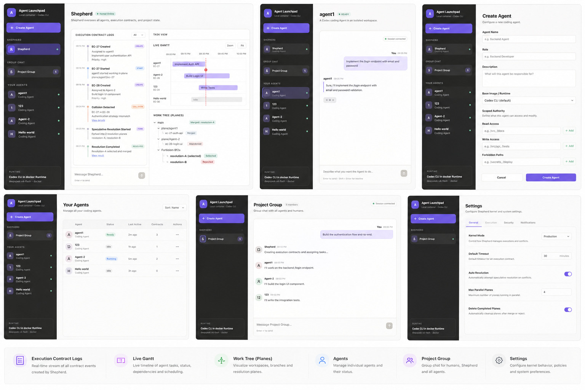
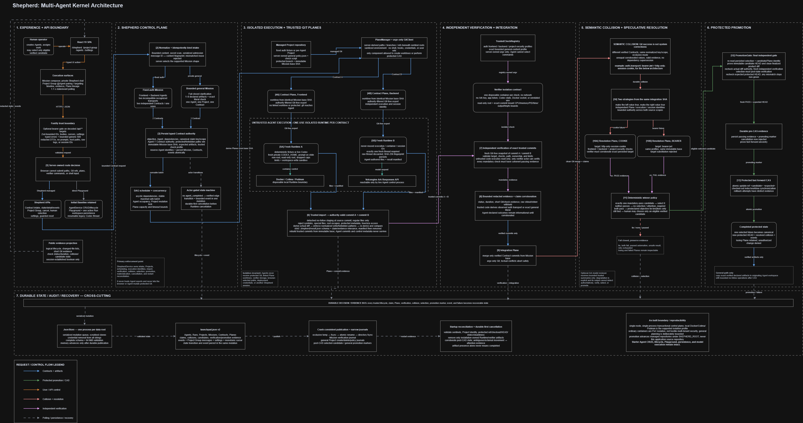
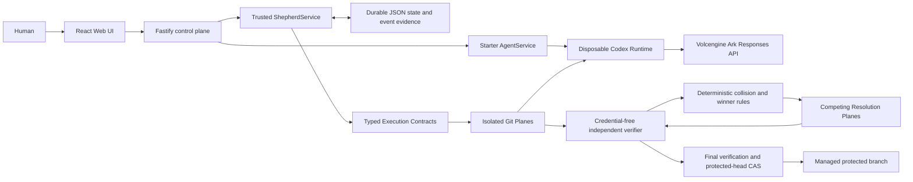

# Shepherd: Multi-Agent Kernel

**TikTok TechJam 2026 · Track 1 — Agent Launchpad middleware**

Shepherd is a transactional execution kernel for teams of coding Agents. It turns
delegated work into verifiable contracts, detects incompatible assumptions that a
clean Git merge cannot see, executes competing resolutions in isolated Git worlds,
and promotes only an independently verified result.

> [!IMPORTANT]
> This README is the self-contained product overview, operating guide, and
> validation entry point. The retained Hackathon v2 source sections are linked
> under [Hackathon artifacts](#hackathon-artifacts).

> [!WARNING]
> This is a single-user proof of concept, not a production identity or multi-tenant
> isolation system. Shepherd enforces scoped authority around its managed projects,
> but the shared bearer token is not user identity, the JSON store is single-process,
> and ordinary containers are not a hardened tenant boundary. Do not use production
> data or credentials.

## The problem

Two coding Agents can both finish their assignments, pass their local checks, and
merge without a textual Git conflict while still making mutually incompatible
system assumptions. The deterministic demo makes that failure concrete: a frontend
uses an HttpOnly session cookie while a backend expects a bearer JWT.

Shepherd inserts a trusted decision path between delegation and promotion:

```text
Contract -> Execute -> Verify -> Detect Collision
         -> Fork Futures -> Verify Futures -> Promote Winner
```

The UI is Mission Control for that kernel. It displays durable backend evidence; it
does not invent success state in the browser.

## Three primitives

1. **Agent Execution Contracts** turn delegation into typed, machine-verifiable
   objectives, dependencies, authority, expected artifacts, claims, and acceptance
   checks. An Agent cannot certify its own work.
2. **Semantic Collision Detection** compares independently verified claims and
   finds behavioral incompatibilities that textual merging misses.
3. **Speculative Conflict Resolution** forks competing futures from one immutable
   integration commit, verifies each independently, and promotes only the
   evidence-derived winner through a final protected-head gate.

Supporting capabilities include Git-worktree-backed **Planes**, scoped authority,
durable Missions and events, a live execution timeline, a Plane Tree, Project Group
routing, bounded model-assisted review, cancellation/recovery, and human selection
when automatic resolution cannot choose uniquely.

## Product tour

### Shepherd Mission Control

The Contract stream, execution timeline, semantic collision, competing Resolution
Planes, retained loser, and promoted winner all come from persisted server state.
Changes outside an Execution Contract's writable scope are rejected with durable
evidence, and protected promotion never starts.



### Preserved Agent Launchpad

Shepherd extends the supplied Starter Kit instead of replacing it. Agent create,
edit, start, stop, delete, asynchronous Runs, multi-turn Playground chat, persistent
workspaces/Codex sessions, and real model execution remain available.


## Architecture



[Open the latest editable Draw.io source](docs/assets/Shepherd_TechJam_Track1_Architecture.drawio).

The React application talks only to the Fastify control plane. Trusted server code
owns schema validation, authority intersection, lifecycle state, Git inspection,
manifest ingestion, independent verification, collision rules, winner selection,
final re-verification, and compare-and-swap promotion. Coding Agents and model
output are untrusted inputs.



Each live turn receives only its selected workspace or authority-filtered Plane
export and its own Codex session directory. It does not receive the protected Git
repository or verifier credentials. The deterministic mode exercises the same
kernel without an external model request.

## Quickstart: deterministic judge flow

The recommended judging path runs locally with Docker, Colima, or rootless Podman.
It exercises real Contracts, Git Planes, verification, collision handling,
resolution, persistence, and promotion without spending model capacity.

### Requirements

- macOS or Linux
- Node.js 22+
- npm 10+
- Docker, Colima, or rootless Podman
- A Volcengine Ark API key and Responses-capable endpoint for the preserved live
  Agent path; the launcher requires these values, but the deterministic Mission
  does not send a model request

Codex CLI is included in the Runtime image and is not required on the host.

### 1. Clone and configure

```bash
git clone https://github.com/kyashp/shepherd.git
cd shepherd
cp .env.example .env
```

Set `ARK_API_KEY` and `ARK_MODEL` in the ignored `.env`. For the reliable
deterministic demo, also set:

```dotenv
HOST=127.0.0.1
SHEPHERD_EXECUTION_MODE=deterministic
SHEPHERD_DEMO_MODE=true
```

### 2. Start

```bash
./scripts/start-local-poc.sh
```

The first run installs dependencies, builds the Runtime image, selects the
available container engine, validates the workspace boundary, and serves the app at
<http://localhost:3000>.

### 3. Run the primary Shepherd Mission

1. Open **Settings -> General -> Reset demo state**. This removes only the managed
   demo state and preserves ordinary Launchpad Agents.
2. Create `Frontend Auth Agent` with role **Frontend** and `Backend Auth Agent` with
   role **Backend**. Both must be ready.
3. Open `Frontend Auth Agent`, enable **Route through Shepherd**, and send:

   ```text
   Implement the frontend authentication client using an HttpOnly session cookie.
   ```

4. Open `Backend Auth Agent`, enable **Route through Shepherd**, and send:

   ```text
   Implement the backend authentication service using a bearer JWT.
   ```

5. The second compatible-role prompt atomically starts one Mission. Open
   **Shepherd** and wait for `completed`.
6. Verify the visible causal chain: two durable Contracts -> isolated Contract
   Planes -> independent verification -> clean textual integration ->
   `auth.transport` semantic collision -> two same-base Resolution Planes -> cookie
   candidate verified and bearer candidate rejected -> final re-verification ->
   protected promotion.
7. Open Contract evidence, use every stream filter, expand the collision, and open
   Plane Tree details. Evidence must not expose secrets, private host paths, raw
   prompts/model output, or session identifiers.

The exact prompts become durable Contract objectives. The frontend and backend
source Planes do not compete with each other; their incompatible verified claims
create two resolution futures after integration.

### 4. Exercise the human-decision path

1. Reset the demo, then open **Settings -> Execution**.
2. Disable **Automatic resolution** and save.
3. Repeat the two private Agent prompts above.
4. At `attention_required`, inspect the durable human-review ticket. Only an
   independently passing future offers **Select verified future**.
5. Select that future and confirm it still passes the same final verification and
   promotion gate. Restore **Automatic resolution** afterward.

This is the recommended recovery/decision story for a manual demo. The automated
authority-denial journey is covered separately by the browser suite.

### 5. Stop and resume

Press `Ctrl+C` in the startup terminal. The launcher removes this instance's
temporary Runtime containers but preserves Agents, conversations, Runs, workspaces,
Codex sessions, and Shepherd evidence.

- macOS host state: `~/.volc-agent-launchpad/`
- Linux host state: `.local/`
- Custom host location: set `LOCAL_POC_DATA_ROOT`
- Engine-native state: set `LOCAL_POC_STATE_MODE=container-volume`

Run `./scripts/start-local-poc.sh` again to continue. The default `auto` state mode
falls back to the `launchpad-state` volume when a VM-backed host share cannot enforce
the Codex sandbox's per-file access rights.

## Preserved live Agent flow

The Starter Kit acceptance path remains available and uses real Ark capacity:

1. Create a **Generalist** Agent named `Manual QA Agent`.
2. In its Playground, send:

   ```text
   Create a dependency-free hello.js that prints "Hello, Shepherd", add a Node test, run it, and report the exact test result.
   ```

3. Send the follow-up `Reply with only the exact greeting produced by hello.js.`
4. Confirm `queued -> running -> completed`, the expected file, and continued
   conversation context.
5. Stop and restart with the same data root; confirm the Agent, messages, Runs, and
   workspace persist.

This flow validates the preserved Agent Playground, not Shepherd's deterministic
Mission. It calls the configured external model and should be run only when that
data transfer and capacity use are authorized. A Track 1 rehearsal should pair this
live Starter Kit continuity check with the deterministic Shepherd Mission and its
human-decision or authority-denial evidence.

## Container engine options

Set `CONTAINER_ENGINE=podman` in `.env` to force Podman. Colima uses
`CONTAINER_ENGINE=docker` because it exposes the Docker CLI. On a clean Linux host,
use a rootless Podman service and ensure its user socket is available to the launcher.

Resource limits are controlled with `CONTAINER_CPU_LIMIT`,
`CONTAINER_MEMORY_LIMIT`, and `CONTAINER_PIDS_LIMIT`. The defaults are 2 CPUs,
2 GiB memory, 256 processes, dropped capabilities, and `no-new-privileges`.

## Docker Compose

Create the ignored local configuration:

```bash
./scripts/bootstrap-local.sh
```

Required values in `.env`:

```dotenv
ARK_API_KEY=your-ark-api-key
ARK_MODEL=ep-your-endpoint-id
```

The base profile publishes on `127.0.0.1` and permits an empty `APP_AUTH_TOKEN`.
To expose the service beyond the machine, set `PUBLIC_BIND_ADDR=0.0.0.0` and a
24+ character `APP_AUTH_TOKEN` in the same change. This API can trigger model,
command, and file execution; never expose a tokenless instance.

```bash
docker compose up --build
```

Open <http://localhost:3000>. Stop without deleting Agent data:

```bash
docker compose down
```

## Development

```bash
npm install
cp .env.example .env
npm install --global @openai/codex@0.111.0
npm run dev
```

- Web UI: <http://localhost:5173>
- API: <http://localhost:3000>

Use host-local paths in `.env` when running outside Docker:

```dotenv
APP_DATA_DIR=.data
AGENT_WORKSPACE_ROOT=workspaces
CODEX_HOME=codex-home
```

The first Playground turn uses `codex exec`; later turns resume the stored Codex
thread. Deleting an Agent archives its workspace under `workspaces/.deleted/`.

## Configuration

| Variable | Default | Purpose |
| --- | --- | --- |
| `ARK_API_KEY` | Required by local launcher | Ark credential for live Agent and Shepherd execution. |
| `ARK_MODEL` | Required by local launcher | Responses-capable endpoint or model ID. |
| `ARK_BASE_URL` | Beijing v3 endpoint | Ark OpenAI-compatible API URL. |
| `APP_AUTH_TOKEN` | Empty on loopback | Shared demo token; use 24+ random URL-safe characters remotely. |
| `SHEPHERD_EXECUTION_MODE` | `auto` | `deterministic`, `live`, or automatic selection. |
| `SHEPHERD_DEMO_MODE` | `false` | Enables the server-owned deterministic demo fixture. |
| `SHEPHERD_MODEL` | Empty | Optional bounded advisory reviewer; never verifies or promotes. |
| `SHEPHERD_AUTO_RESOLUTION` | `true` | Startup seed for automatic candidate selection. |
| `SHEPHERD_MAX_PARALLEL_PLANES` | `2` | Startup seed for bounded Plane concurrency. |
| `RUNTIME_PROVIDER` | `local-process` | `container` for disposable local Runtime containers. |
| `CODEX_SANDBOX_MODE` | `workspace-write` | Inner Codex sandbox request. |
| `CODEX_TIMEOUT_MS` | `600000` | Maximum duration of one Agent turn. |
| `LOCAL_POC_DATA_ROOT` | Platform-specific | Host metadata, workspace, and session root. |
| `LOCAL_POC_STATE_MODE` | `auto` | Host bind, engine volume, or automatic safe fallback. |

See [.env.example](.env.example) for verifier, timeout, Runtime image, mirror,
state-volume, and resource-limit options.

## Validation and evidence

The default test suites do not call Ark. Dependency, browser, Terraform, and image
setup may still download their pinned artifacts:

```bash
npm ci
npm run check
npm run test:coverage
npm run test:e2e:install
npm run test:e2e:harness
npm run test:terraform
npm run test:shepherd:container
npm run test:shepherd:live:preflight
npm audit --json
```

- `npm run check` runs strict production and test-source typechecks, root script
  tests, Server/Web tests, and production builds. Server test files run serially
  so process, filesystem, and real-container cases cannot starve one another's
  causal time budgets.
- `npm run test:coverage` enforces at least 80% statements, branches, functions,
  and lines for both Server and browser-owned Web source, with every production
  source file present.
- `npm run test:e2e:harness` runs the deterministic Chromium matrix configured in
  `playwright.config.ts`.
- `npm run test:terraform` validates a disposable Terraform module using local
  Terraform or the pinned `hashicorp/terraform:1.9.8` image.
- `npm run test:shepherd:container` requires the configured container engine and
  Runtime image, then runs the deterministic Mission through the real independent
  verifier. The local PoC launcher builds the default `volc-agent-runtime:local`
  image; this gate fails instead of skipping when either prerequisite is absent.
- `npm run test:shepherd:live:preflight` builds and inspects the exact-tree live
  Runtime boundary without contacting Ark.

The bounded external Shepherd gate is deliberately separate:

```bash
npm run test:shepherd:live
```

It sends repository-derived prompts and scoped source content to the configured Ark
endpoint and consumes real capacity. Run it only with explicit authorization. Never
attach raw prompts, model output, credentials, session identifiers, or private paths
to issues or reports.

When publishing results, record the exact tested commit, environment, pass counts,
coverage, failures, and any evidence gaps. Do not present an earlier run as evidence
for a newer tree.

## Optional cloud deployment

Local Docker, Colima, or Podman is the recommended judging path. ECS is optional
and does not increase the Track 1 score by itself.

### Existing Linux ECS

Use a dedicated Ubuntu 22.04/24.04, Debian 12, or veLinux 2 instance with at least
2 vCPU, 4 GiB RAM, a 40 GiB disk, Docker Engine 24+, and the Compose plugin. The
existing-ECS script deploys the current source tree:

```bash
cp .env.example .env.production
openssl rand -hex 32
# Set PUBLIC_BIND_ADDR=0.0.0.0, PUBLIC_PORT, ARK_API_KEY, ARK_MODEL,
# and the generated APP_AUTH_TOKEN in .env.production.
chmod 600 .env.production
./scripts/deploy-existing-ecs.sh .env.production
```

Verify without printing credentials:

```bash
read -rsp 'APP_AUTH_TOKEN: ' APP_AUTH_TOKEN; export APP_AUTH_TOKEN; printf '\n'
curl http://127.0.0.1/api/health
curl -H "Authorization: Bearer $APP_AUTH_TOKEN" http://127.0.0.1/api/system
docker compose --env-file .env.production ps
```

Allow inbound HTTP only from the event network, SSH only from administrator
addresses, and outbound HTTPS only where required. Add HTTPS before sending the
shared bearer token over an untrusted network. Rerun the same deploy script after
`git pull --ff-only`; `docker compose --env-file .env.production down` stops the
service without deleting Agent data.

### Terraform

The Terraform path requires Terraform 1.6+, a Volcengine account with scoped
resource-creation permission, an existing ECS SSH key pair, a compatible image and
instance type, and a public repository URL.

```bash
cp .env.example .env.production
cp deploy/volcengine/terraform.tfvars.example \
  deploy/volcengine/terraform.tfvars
export VOLCENGINE_ACCESS_KEY=your-access-key
export VOLCENGINE_SECRET_KEY=your-secret-key
export VOLCENGINE_SSH_PRIVATE_KEY=/absolute/path/to/the-matching-private-key.pem
# Optional when the image does not use Ubuntu's default account:
export VOLCENGINE_SSH_USER=ubuntu
./scripts/deploy-volcengine.sh
```

Put Ark/runtime values only in `.env.production` and infrastructure values in
`terraform.tfvars`. Volcengine account credentials stay in the current shell and
must never be given to an Agent Runtime. The deploy script waits for cloud-init,
copies the ignored environment over SSH as root-owned mode `0600`, and starts the
application; runtime credentials do not enter Terraform variables, plans, state,
cloud-init, or instance user data.

Use a dedicated test instance. Never commit `.env.production`, Terraform variables
or state, Ark keys, SSH keys, or Volcengine account credentials. Protect Terraform
state because it still contains infrastructure identifiers and network metadata.
`terraform -chdir=deploy/volcengine destroy` removes the ECS instance, system disk,
and Agent workspaces.

## Hackathon artifacts

- [Interface reference](docs/UI.jpeg)
- [Rendered architecture diagram](docs/assets/Shepherd_TechJam_Track1_Architecture.png)
- [Latest editable architecture diagram](docs/assets/Shepherd_TechJam_Track1_Architecture.drawio)
- [Agent Playground screenshot](docs/assets/playground.jpg)
- [Create Agent screenshot](docs/assets/create-agent.jpg)
- [Hackathon v2 skeleton](docs/hackathon-v2-skeleton.xml)
- [Section 1](docs/hackathon-v2-section-1.xml)
- [Section 2](docs/hackathon-v2-section-2.xml)
- [Section 3](docs/hackathon-v2-section-3.xml)
- [Section 4](docs/hackathon-v2-section-4.xml)
- [Section 5](docs/hackathon-v2-section-5.xml)
- [Section 6](docs/hackathon-v2-section-6.xml)
- [Section 7](docs/hackathon-v2-section-7.xml)
- [Section 8](docs/hackathon-v2-section-8.xml)
- [Section 9](docs/hackathon-v2-section-9.xml)

## License

[MIT](LICENSE)
