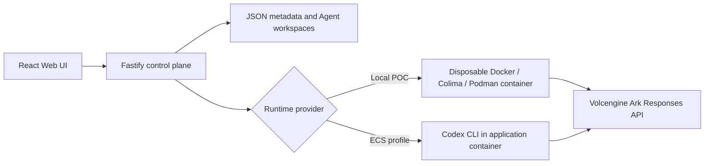

# Volc Agent Launchpad + Shepherd

> [!IMPORTANT]
> Start with [the Shepherd task ledger](docs/TASKS.md). It is the authoritative
> current-state, defect, remaining-work, evidence, and multi-agent workflow entry
> point. [The PRD](docs/PRD.md) remains the requirement authority, and
> [the Local POC guide](docs/LOCAL_POC.md) is the runbook.
> This README still preserves much of the Starter Kit setup material and is not
> the final PRD Phase 9 project report.

A minimal Agent platform for three-day middleware hackathons. It provides Agent
CRUD, a browser Playground, persistent workspaces, and Codex CLI backed by the
Volcengine Ark Responses API.

Run it locally with Docker, Colima, or rootless Podman, or deploy it to
Volcengine ECS.

> [!WARNING]
> This is a single-user proof of concept. It has no production identity,
> multi-tenant authorization, or hardened tenant-isolation boundary. Shepherd
> adds a scoped execution/audit kernel for its managed demo project, but this is
> not a production security claim. Do not use production data or credentials.
> See [SECURITY.md](SECURITY.md).

## Screenshots

### Agent Playground


### Create an Agent


## Features

- Shepherd Execution Contracts, Git-backed Planes, independent verification,
  deterministic semantic collision detection, speculative resolution, and
  protected promotion for the managed authentication fixture
- Shepherd Mission Control, Project Group, timeline, Plane Tree, Agent role and
  authority configuration, and settings UI (with known gaps itemized in the task ledger)
- React and TypeScript Web UI
- Agent create, edit, start, stop, delete, and multi-turn chat
- Fastify control plane with asynchronous Run state
- Persistent Agent workspaces and Codex sessions
- Disposable Docker, Colima, or Podman container for each local turn
- Docker and Terraform deployment paths for Volcengine ECS

## Requirements

- Node.js 22+
- npm 10+
- Docker, Colima, or Podman
- A Volcengine Ark API key and endpoint that supports the Responses API

Codex CLI is included in the Runtime image and is not required on the host.

## Local browser SOP

For the currently verified deterministic Shepherd command and exact manual test
walkthrough, use [the Local POC runbook](docs/LOCAL_POC.md).

### 1. Check the local tools

Install Node.js 22+ and one supported container engine, then verify them:

```bash
node --version
npm --version
docker --version        # Docker Desktop, Docker Engine, or Colima
podman --version        # Use this instead when running Podman
```

Only one container engine is required. Codex CLI is already included in the
Runtime image.

### 2. Clone the repository

```bash
git clone <repository-url> volc-agent-launchpad
cd volc-agent-launchpad
```

Skip this step when already working from the repository root.

### 3. Start the POC

Configure `ARK_API_KEY` and `ARK_MODEL` in the repository's ignored `.env`, then
run the single local entry point without additional parameters:

```bash
./scripts/start-local-poc.sh
```

The first run installs Node.js dependencies and builds the Runtime image. The
script automatically selects Docker, Colima, or Podman.

### 4. Open the browser

Visit <http://localhost:3000>, or open it from the terminal:

```bash
open http://localhost:3000       # macOS
xdg-open http://localhost:3000   # Linux desktop
```

In the Web UI:

1. Select **Create Agent**.
2. Enter a name, description, and workspace instructions.
3. Select **Create Agent** again.
4. Enter a task in the Playground, for example:

   ```text
   Create a TypeScript hello-world CLI, add a test, and run it.
   ```

The Agent can write files, run commands, and continue the same Codex session in
later messages.

### 5. Stop and resume

Press `Ctrl+C` in the startup terminal. The script removes temporary Runtime
containers but keeps Agent workspaces and conversations.

- macOS state: `~/.volc-agent-launchpad/`
- Linux state: `.local/`
- Custom location: set `LOCAL_POC_DATA_ROOT`

Run the same `./scripts/start-local-poc.sh` command to continue later.

### Select a specific container engine

Force Podman when multiple engines are installed by setting
`CONTAINER_ENGINE=podman` in `.env`, then run:

```bash
./scripts/start-local-poc.sh
```

Colima uses `CONTAINER_ENGINE=docker` because it exposes the Docker CLI.

For a clean Linux host, follow the
[rootless Podman setup](docs/LOCAL_POC.md#rootless-podman-on-linux).

## Docker Compose

Create and edit the configuration:

```bash
./scripts/bootstrap-local.sh
```

Required values in `.env`:

```dotenv
ARK_API_KEY=your-ark-api-key
ARK_MODEL=ep-your-endpoint-id
```

`APP_AUTH_TOKEN` is optional and empty by default, so nothing else is needed to
start. The container profile publishes on `127.0.0.1` by default, so the quickstart
is not reachable from the network and a tokenless start is safe.

To expose it beyond this machine, set `PUBLIC_BIND_ADDR` (for example `0.0.0.0`) and
set `APP_AUTH_TOKEN` to 24+ random URL-safe characters **in the same change**. The
API performs prompt-triggered command and file execution, so an exposed instance
without a token hands that to anyone who can reach the port.

Start the application:

```bash
docker compose up --build
```

Open <http://localhost:3000>. Stop it without deleting Agent data:

```bash
docker compose down
```

## Development

```bash
npm install
cp .env.example .env
npm install --global @openai/codex@0.111.0
npm run dev
```

- Web UI: <http://localhost:5173>
- API: <http://localhost:3000>

Use local paths in `.env` when running outside Docker:

```dotenv
APP_DATA_DIR=.data
AGENT_WORKSPACE_ROOT=workspaces
CODEX_HOME=codex-home
```

## Optional cloud deployment

Local Docker, Colima, or Podman is the recommended judging path; see
[the Local POC guide](docs/LOCAL_POC.md). The repository retains optional existing
ECS and Terraform deployment scripts, but cloud deployment does not improve the
Track 1 score by itself.

### Existing Linux ECS

Use a dedicated Ubuntu 22.04/24.04, Debian 12, or veLinux 2 instance with at
least 2 vCPU, 4 GiB RAM, a 40 GiB disk, Docker Engine 24+, and the Compose plugin.
The path was verified on veLinux 2 with Docker Engine 29.6.2 and Compose 5.3.1;
Debian 10 is unsupported. Follow Docker's official repository instructions,
verify the downloaded signing-key fingerprint, log in again after group changes,
and check `docker version`, `docker compose version`, and
`docker run --rm hello-world` before deployment. Do not replace the engine on a
host that contains important workloads.

veLinux 2 uses Docker's Debian 12 Bookworm repository. Resolve the supported parent
before following the official Docker key/repository installation steps:

```bash
. /etc/os-release
case "$ID" in
  ubuntu|debian)
    DOCKER_DISTRO="$ID"
    DOCKER_CODENAME="$VERSION_CODENAME"
    ;;
  velinux)
    DOCKER_DISTRO=debian
    DOCKER_CODENAME=bookworm
    ;;
  *)
    echo "Use the Docker-supported parent distribution."
    exit 1
    ;;
esac
```

Install `ca-certificates`, `curl`, `gnupg`, `git`, and `openssl`; download the key
from `https://download.docker.com/linux/$DOCKER_DISTRO/gpg`; compare its complete
fingerprint with Docker's official installation guide; place the dearmored key in
`/etc/apt/keyrings/docker.gpg`; and configure the stable repository with
`$DOCKER_CODENAME`. Then install Docker Engine, CLI, containerd, Buildx, and Compose.

The existing-ECS script deploys from the current source tree:

```bash
cp .env.example .env.production
openssl rand -hex 32
# Set PUBLIC_PORT, ARK_API_KEY, ARK_MODEL, and the generated APP_AUTH_TOKEN.
chmod 600 .env.production
./scripts/deploy-existing-ecs.sh .env.production
```

Verify the result without printing credentials:

```bash
read -rsp 'APP_AUTH_TOKEN: ' APP_AUTH_TOKEN; export APP_AUTH_TOKEN; printf '\n'
curl http://127.0.0.1/api/health
curl -H "Authorization: Bearer $APP_AUTH_TOKEN" http://127.0.0.1/api/system
docker compose --env-file .env.production ps
```

This profile is meant to be reachable, so set `PUBLIC_BIND_ADDR=0.0.0.0` in
`.env.production` alongside `APP_AUTH_TOKEN`; the deploy script refuses to start
without a valid token. Deploy updates with `git pull --ff-only` and rerun the same
script. Allow inbound HTTP only from the event network, SSH only from administrator addresses, and
outbound HTTPS only where required. Add HTTPS before sending the shared bearer token
over an untrusted network. `docker compose --env-file .env.production down` stops
the service without deleting Agent data.

### Terraform

The Terraform path requires Terraform 1.6+, a Volcengine account with scoped
resource-creation permission, an existing ECS SSH key pair, a compatible image and
instance type in the selected region, and a public repository URL.

The Terraform path provisions VPC, subnet, security group, ECS, and EIP:

```bash
cp .env.example .env.production
cp deploy/volcengine/terraform.tfvars.example \
  deploy/volcengine/terraform.tfvars
export VOLCENGINE_ACCESS_KEY=your-access-key
export VOLCENGINE_SECRET_KEY=your-secret-key
export VOLCENGINE_SSH_PRIVATE_KEY=/absolute/path/to/the-matching-private-key.pem
# Optional when the image does not use Ubuntu's default account:
export VOLCENGINE_SSH_USER=ubuntu
./scripts/deploy-volcengine.sh
```

Set Ark values only in `.env.production` and region/zone/image/instance/key/CIDR/
repository values in `terraform.tfvars`. Provide Volcengine account credentials only
through the current shell; never give account AK/SK values to an Agent Runtime.
Terraform provisions only infrastructure and public repository metadata. The deploy
script waits for `cloud-init status --wait`, copies the ignored `.env.production`
over SSH, installs it as root-owned mode `0600`, and then starts the application.
Runtime credentials therefore do not enter Terraform variables, plans, state,
cloud-init, or instance user data.

Use a dedicated test instance. Never commit `.env.production`, Terraform variables
or state, Ark keys, SSH keys, or Volcengine account credentials. Protect Terraform
state because it still contains infrastructure identifiers and network metadata.
`terraform -chdir=deploy/volcengine destroy` removes the ECS instance, system disk,
and Agent workspaces—back up required code and data first.

## Configuration

| Variable | Default | Purpose |
| --- | --- | --- |
| `ARK_API_KEY` | Required | Ark model API key. |
| `ARK_MODEL` | Required | Responses-capable endpoint or model ID. |
| `ARK_BASE_URL` | Beijing v3 endpoint | Ark OpenAI-compatible API URL. |
| `APP_AUTH_TOKEN` | Empty | Optional shared demo token. Empty requires no credential; use 24+ random characters remotely. |
| `RUNTIME_PROVIDER` | `local-process` | `container` for disposable local Runtime containers. |
| `CODEX_SANDBOX_MODE` | `workspace-write` | Codex inner sandbox mode. |
| `CODEX_TIMEOUT_MS` | `600000` | Maximum duration of one turn. |
| `LOCAL_POC_DATA_ROOT` | Platform-specific | Local metadata, workspace, and session directory. |

See [.env.example](.env.example) for all Runtime and resource-limit options.

## How it works



The first turn uses `codex exec`; later turns resume the stored Codex thread.
Deleting an Agent archives its workspace under `workspaces/.deleted/`.

See [docs/ARCHITECTURE.md](docs/ARCHITECTURE.md) for component and extension
boundaries.

## Validation

```bash
npm run check
npm run test:coverage
npm run test:terraform
docker compose config
```

`npm run test:terraform` uses local Terraform when available and otherwise the
pinned `hashicorp/terraform:1.9.8` image. It formats, initializes, and validates a
disposable copy so generated provider files never dirty the checkout.

## Documentation

- [Current task ledger and completion cut](docs/TASKS.md)
- [Shepherd product requirements](docs/PRD.md)
- [Shepherd design and trust boundaries](docs/SHEPHERD.md)
- [Architecture](docs/ARCHITECTURE.md)
- [Local POC](docs/LOCAL_POC.md)
- [Track 1 TechJam brief](docs/TECHJAM.md)
- [Hackathon extension guide](docs/HACKATHON_EXTENSION_GUIDE.md)
- [Security policy](SECURITY.md)
- [Contributing](CONTRIBUTING.md)

## License

[MIT](LICENSE)
