# Agent Middleware Architecture

This document describes the as-built architecture on protected `main` at
`c0802e8`. It covers both the original Agent Launchpad path and the Shepherd
multi-Agent middleware layered beside it. The implementation is authoritative;
[`PRD.md`](PRD.md) defines the intended product, [`SHEPHERD.md`](SHEPHERD.md)
records the as-built trust model, and [`TASKS.md`](TASKS.md) records current
completion and evidence status.

Shepherd is a single-node transactional control plane for coding Agents. It turns
an assignment into a durable Execution Contract, runs the Agent against an isolated
Git-backed Plane, independently verifies the resulting commit, detects incompatible
semantic claims, executes competing resolutions from the same integration commit,
and advances the protected branch only through an evidence-gated compare-and-swap.

> **Contract → isolated execution → trusted import → authority validation →
> independent verification → semantic collision → speculative resolution →
> deterministic selection → final re-verification → protected promotion**

## Full end-to-end architecture

Solid edges are control/data flow. Dashed edges are polling, advisory analysis, or
recovery. Red nodes contain untrusted input or execution, green nodes make trusted
decisions, blue nodes are durable state or Git artifacts, and purple nodes are
external systems.

```mermaid
flowchart TB
    Human["Human operator"]

    subgraph Browser["Experience layer — browser, untrusted input"]
        React["React 19 single-page application"]
        AgentUI["Agents / Create / Edit / Playground"]
        ShepherdUI["Contract stream / timeline / Plane tree"]
        GroupUI["Project Group"]
        SettingsUI["Settings / reset / human selection"]
        Poller["1.1 s state, event, and group-message polling"]
        Token["In-memory shared demo bearer token"]
        React --> AgentUI
        React --> ShepherdUI
        React --> GroupUI
        React --> SettingsUI
        ShepherdUI --> Poller
        GroupUI --> Poller
        Token --> React
    end

    subgraph HTTP["Fastify boundary — trusted validation and public projection"]
        Auth["Bearer gate for /api except health and auth"]
        Zod["Zod schemas: bounded IDs, bodies, cursors, settings"]
        AgentAPI["Legacy Agent / message / Run / system routes"]
        ShepherdAPI["Shepherd state / Mission / events / details / controls"]
        PublicDTO["Redacted public DTOs: no prompts, host paths, raw logs, or session IDs"]
        Errors["Typed status mapping and bounded generic 500"]
        Static["Production React assets and SPA fallback"]
        Auth --> Zod
        Zod --> AgentAPI
        Zod --> ShepherdAPI
        AgentAPI --> PublicDTO
        ShepherdAPI --> PublicDTO
        Errors --> PublicDTO
    end

    subgraph Legacy["Existing Agent control plane — AgentService"]
        AgentCRUD["Agent CRUD, roles, authority presets, lifecycle"]
        Playground["Message admission and one active Run per Agent"]
        LegacyRecovery["Restart: active Runs → cancelled; busy Agents → ready"]
        WorkspaceManager["Server-derived workspaces; no-follow files; archive on delete"]
        RunnerFactory{"RUNTIME_PROVIDER"}
        LocalRunner["CodexRunner: bounded local child process"]
        ContainerRunner["ContainerCodexRunner: disposable local Runtime"]
        Thread["Resumable legacy Codex thread per Agent"]
        AgentCRUD --> WorkspaceManager
        Playground --> WorkspaceManager
        Playground --> RunnerFactory
        RunnerFactory -->|"local-process"| LocalRunner
        RunnerFactory -->|"container"| ContainerRunner
        LocalRunner --> Thread
        ContainerRunner --> Thread
    end

    subgraph Kernel["Shepherd control plane — trusted orchestration"]
        Intake["Fixed auth-demo intake and idempotent request binding"]
        Reserve["Validate Agent role, readiness, authority; reserve Agent"]
        Contracts["Persist Mission and two typed Execution Contracts"]
        DAG["Validate DAG and select maximal safe runnable batch"]
        StateMachine["Actor-gated Mission and Contract state machines"]
        EventWriter["State transition plus bounded event in one mutation"]
        Concurrency["Project lock, Agent occupancy, Plane-capacity bound"]
        Cancel["Durable cancellation before exact Runtime cancellation"]
        Intake --> Reserve --> Contracts --> DAG --> Concurrency
        Contracts --> StateMachine --> EventWriter
        Cancel --> StateMachine
    end

    subgraph GitPlane["Git / Plane boundary — trusted, argv-only, sentinel-guarded"]
        ProtectedRepo["Managed auth fixture repository\nprotected branch + expected HEAD"]
        PlaneManager["PlaneManager derives all branches and paths"]
        GitClient["GitClient: sanitized refs/paths; no shell/hooks/credentials; bounded I/O"]
        ContractWT["Contract worktrees from Mission base SHA"]
        Export["Authority-filtered Git-free execution export"]
        Import["Bounded no-follow staging import; reject links, special files, metadata, and denied diff"]
        Manifest["Strict result-manifest ingestion; validate claims/evidence; then remove"]
        TrustedCommit["Rebuild trusted Contract commit from base; exclude control metadata"]
        VerifySnapshot["Fresh Git-free read-only snapshot of exact commit"]
        IntegrationWT["Integration Plane merges verified Contract commits"]
        IntegrationSHA["Immutable integration commit"]
        ResolutionWT["Two resolution worktrees from identical integration SHA"]
        CandidateCommit["Trusted candidate commits; no manifest channel"]
        PromotionCAS["Protected fast-forward CAS plus checked-out worktree synchronization"]
        PlaneManager --> GitClient --> ProtectedRepo
        PlaneManager --> ContractWT --> Export
        Import -->|"Contract"| Manifest --> TrustedCommit
        Import -->|"Resolution candidate; manifest forbidden"| CandidateCommit
        TrustedCommit --> VerifySnapshot
        TrustedCommit --> IntegrationWT --> IntegrationSHA --> ResolutionWT
        PromotionCAS --> ProtectedRepo
    end

    subgraph AgentExecution["Agent Runtime boundary — untrusted model output and files"]
        Executor{"Resolved Shepherd execution mode"}
        FixtureExecutor["DeterministicFixtureExecutor\nnetwork-free deterministic writes"]
        Prompt["Bounded JSON prompt envelope\nidentity, objective, context, authority, artifacts, claims"]
        PrivateHome["Fresh private CODEX_HOME per execution\nminimal config; deleted afterward"]
        LiveExecutor["CodexShepherdExecutor\none-use execution and session identities"]
        RuntimeContainer["Disposable non-root container\nread-only root, dropped caps, limits, bridge network"]
        Codex["codex exec --ephemeral --json\nprompt on stdin; workspace-write sandbox"]
        AgentFiles["Agent-authored project files and Contract result manifest"]
        SessionHash["Require one fresh thread ID; persist only SHA-256 fingerprint"]
        Executor -->|"deterministic"| FixtureExecutor --> AgentFiles
        Executor -->|"live"| Prompt --> LiveExecutor --> PrivateHome --> RuntimeContainer --> Codex
        Codex --> AgentFiles
        Codex --> SessionHash
    end

    subgraph Verification["Independent verification — trusted interpretation, untrusted code under test"]
        Registry["TrustedCheckRegistry: profile ID → server-owned argv"]
        Verifier["ContainerVerifier validates target, checks, path, limits, ownership"]
        VerifyContainer["One disposable container per check\nno network/key/session; read-only mount/root; bounded resources"]
        Evidence["Bounded redacted VerificationEvidence"]
        Corroborate["Corroborate semantic transport from verifier output"]
        Registry --> Verifier --> VerifyContainer --> Evidence --> Corroborate
    end

    subgraph Semantics["Collision and speculative resolution — trusted policy"]
        Claims["Normalized, evidence-backed exclusive claims"]
        Advisory["Optional ArkModelReviewer\nstrict structured advisory output"]
        Detect["Deterministic collision predicate"]
        Collision["Durable auth.transport collision without Git conflict"]
        Strategies["Generate exact left-value and right-value strategies"]
        CandidateExec["Execute resolution Planes concurrently"]
        CandidateVerify["Verify frontend, backend, project security, and exact target"]
        Winner{"Deterministic winner policy"}
        Auto["Exactly one mandatory-pass candidate selected"]
        Attention["Both fail, tie, paused automation, or unsafe result → attention_required"]
        HumanSelect["Human may select only an eligible verified candidate"]
        FinalGate["Re-read selection; immutable head; actual-diff authority; fresh verification; expected protected HEAD"]
        Claims --> Detect --> Collision --> Strategies --> CandidateExec --> CandidateVerify --> Winner
        Advisory -.-> Detect
        Winner -->|"one passes"| Auto --> FinalGate
        Winner -->|"none / tie / paused"| Attention
        Attention -->|"valid tie or confirmation"| HumanSelect --> FinalGate
    end

    subgraph Persistence["Durable single-process state boundary"]
        Store["JsonStore queue: clone, scrub, schema-validate, size-bound"]
        DB["launchpad.json v2\nAgents, Runs, Missions, Contracts, Planes, claims, collisions, candidates, events, messages, settings"]
        Atomic["Exclusive temp → fsync → atomic rename → directory fsync"]
        Journal["Narrow Mission-verification persistence-intent journal"]
        Cursor["Monotonic durable event cursor"]
        Startup["Startup reconciliation: owned artifacts, Git state, in-flight lifecycle, post-CAS evidence"]
        Store --> Atomic --> DB
        Store --> Journal
        Store --> Cursor
        DB -.-> Startup
    end

    subgraph External["External systems"]
        Ark["Volcengine Ark Responses API"]
        Engine["Docker / Colima / Podman"]
    end

    Human --> React
    Static --> React
    React --> Auth
    Poller -.-> Auth
    PublicDTO --> React
    AgentAPI --> AgentCRUD
    AgentAPI --> Playground
    ShepherdAPI --> Intake
    ShepherdAPI --> Cancel
    ShepherdAPI --> HumanSelect
    AgentCRUD --> Store
    Playground --> Store
    LegacyRecovery --> Store
    WorkspaceManager --> Store
    LocalRunner --> Ark
    ContainerRunner --> Engine
    ContainerRunner --> Ark
    EventWriter --> Store
    Contracts --> Store
    Concurrency --> PlaneManager
    PlaneManager --> Store
    Export --> Executor
    AgentFiles --> Import
    SessionHash --> Store
    VerifySnapshot --> Verifier
    Corroborate --> Claims
    Corroborate --> StateMachine
    StateMachine --> IntegrationWT
    IntegrationSHA --> Advisory
    Advisory -.-> Ark
    Strategies --> ResolutionWT
    ResolutionWT --> Export
    CandidateCommit --> VerifySnapshot
    Evidence --> CandidateVerify
    FinalGate --> VerifySnapshot
    Evidence -->|"fresh promotion evidence"| FinalGate
    FinalGate --> PromotionCAS
    Collision --> Store
    CandidateVerify --> Store
    Winner --> Store
    FinalGate --> Store
    RuntimeContainer --> Engine
    VerifyContainer --> Engine
    Codex --> Ark
    Startup -.-> Store
    Startup -.-> PlaneManager
    Startup -.-> Engine

    classDef untrusted fill:#fff1f0,stroke:#b42318,color:#5f160f,stroke-width:2px
    classDef trusted fill:#ecfdf3,stroke:#027a48,color:#054f31,stroke-width:2px
    classDef durable fill:#eff8ff,stroke:#175cd3,color:#102a56,stroke-width:2px
    classDef external fill:#f4f3ff,stroke:#6938ef,color:#2d1b69,stroke-width:2px
    class Human,React,AgentUI,ShepherdUI,GroupUI,SettingsUI,Poller,Token,FixtureExecutor,Prompt,PrivateHome,LiveExecutor,RuntimeContainer,Codex,AgentFiles,VerifyContainer untrusted
    class Auth,Zod,AgentAPI,ShepherdAPI,PublicDTO,Errors,AgentCRUD,Playground,LegacyRecovery,WorkspaceManager,RunnerFactory,LocalRunner,ContainerRunner,Intake,Reserve,Contracts,DAG,StateMachine,EventWriter,Concurrency,Cancel,PlaneManager,GitClient,Import,Manifest,TrustedCommit,Registry,Verifier,Corroborate,Claims,Advisory,Detect,Collision,Strategies,CandidateVerify,Winner,Auto,Attention,HumanSelect,FinalGate,PromotionCAS trusted
    class ProtectedRepo,ContractWT,Export,VerifySnapshot,IntegrationWT,IntegrationSHA,ResolutionWT,CandidateCommit,Thread,SessionHash,Evidence,Store,DB,Atomic,Journal,Cursor,Startup durable
    class Ark,Engine external
```

## Boundaries and responsibilities

Shepherd is not implemented by expanding `AgentService`. The process composes two
control planes over one durable store:

| Boundary | Responsibility | It must not do |
| --- | --- | --- |
| React experience | Render Agents, Missions, Contracts, events, evidence, timeline, Plane lineage, Project Group, and settings; submit typed controls; poll durable state. | Choose winners, validate authority, interpret verification, or submit host paths/commands. |
| Fastify | Authenticate shared-demo API calls, validate request shapes, map typed errors, and create safe public DTOs. | Return repository/worktree/workspace paths, Run prompts, raw verifier output, or session IDs. |
| `AgentService` | Preserve Agent CRUD, lifecycle, workspaces, Playground, resumable Runs, and one-active-Run admission. | Own Missions, Contracts, Planes, collisions, or promotion. |
| `ShepherdService` | Own Mission lifecycle and orchestrate scheduling, Planes, execution, import, verification, collision, candidates, selection, promotion, cancellation, reset, events, and recovery. | Trust an Agent report, execute browser commands, or mutate protected Git directly. |
| `PlaneManager` / `GitClient` | Derive managed paths/branches, create worktrees, export/import Git-free trees, inspect actual diffs, build commits, merge, and perform the only protected CAS. | Give an Agent a worktree, invoke a shell, inherit Git credentials/hooks, or accept unvalidated paths/refs. |
| Agent executor | Produce files for exactly one execution identity in an exported workspace. | Certify acceptance, select a candidate, access protected Git, or reuse a Shepherd session. |
| Independent verifier | Run registry-owned checks against a read-only exact-commit snapshot and return bounded evidence. | Receive Ark credentials, Codex state, network, writable project storage, or Agent-selected commands. |
| Deterministic policy | Corroborate claims, detect collisions, assess mandatory evidence, handle ties, and gate promotion. | Treat advisory model output as authority or prefer a strategy by name. |
| `JsonStore` | Serialize and atomically publish a validated/redacted database and allocate events with state changes. | Support multiple writers or distributed coordination. |

## Process composition and startup

`apps/server/src/index.ts` is the composition root:

1. `loadConfig()` validates environment configuration. A non-loopback bind requires
   a strong shared bearer token. `auto` Shepherd mode resolves to `live` only with a
   container Runtime and usable Ark Agent configuration; otherwise it is
   `deterministic`.
2. The process writes shared legacy Codex configuration, resolves a restart-stable
   installation owner from a persisted nonce, and creates one `JsonStore`,
   `WorkspaceManager`, and `AgentRunner`.
3. `AgentService.initialize()` initializes storage/workspaces, validates persisted
   workspace identity, cancels interrupted legacy Runs, and releases busy Agents.
4. The process registers trusted frontend, backend, and project-security check
   profiles, then chooses `CodexShepherdExecutor` or
   `DeterministicFixtureExecutor`. A usable `SHEPHERD_MODEL` also composes the
   advisory `ArkModelReviewer`.
5. `ShepherdService.initialize()` reconciles a persistence intent, validates or
   establishes sentinel-guarded roots, cleans only installation-owned Runtime and
   verifier artifacts, reconciles durable Git/lifecycle state, and runs the
   credential-free live Runtime preflight.
6. Fastify registers the API and serves the compiled React app in production.

Startup fails closed on ambiguous sentinels, unexpected managed-root contents,
unsafe workspace identities, an untrusted protected checkout, incomplete owned
container cleanup, or a failed live preflight.

## Flow A: legacy Agent Playground

1. The browser creates or updates an Agent with a role and normalized authority
   preset. `WorkspaceManager` derives its directory from the server-generated ID
   and manages instructions/files with no-follow operations.
2. A Playground message creates a durable user message and queued `AgentRun` in the
   same mutation that atomically sets the Agent `busy`. Concurrent admission permits
   only one Run per Agent.
3. `RunnerFactory` selects bounded host-process Codex or a disposable local Runtime
   container mounting the Agent workspace and shared legacy `CODEX_HOME`.
4. A successful first turn persists the Codex thread ID. Follow-ups use
   `codex exec resume`, preserving legacy conversation continuity.
5. Output, usage, Run state, assistant message, and Agent state persist. Public
   responses omit Run prompts and workspace paths.
6. Stop/cancel terminates the exact process/container. Restart converts active Runs
   to `cancelled`; no interrupted Run is reported complete.

Legacy authority metadata constrains future Shepherd assignment. It is not enforced
as a filesystem sandbox for ordinary Playground turns.

## Flow B: Shepherd Mission

### 1. Intake and Contract creation

Protected main accepts one constrained plan: the authentication demo. The browser
may supply bounded intent, two different ready Agents with Frontend/Backend roles,
and two different typed transports. It cannot supply repository paths, Plane paths,
Git refs, verification commands, or arbitrary plan structure.

Admission binds each client message ID to a fingerprint of intent and assignments,
enforces one active mutating Mission, revalidates the protected repository and
expected HEAD, intersects Contract authority with Agent authority, reserves both
Agents, and atomically persists the Mission, two Contracts, initial events, and
group message. Each Contract durably records its objective, Agent, dependencies,
semantic scope and canonical claim key, authority, expected artifact, trusted
acceptance check, manifest location, lifecycle, failure, and verification evidence.

### 2. DAG scheduling

The scheduler validates general acyclic Contract graphs and rejects unknown,
duplicate, self, cyclic, cross-Mission, or inconsistent dependency data. A Contract
runs only when the Mission is active, required dependencies are `verified`, the
Agent is free, the mutation lock permits it, and Plane capacity remains. It returns
the maximal stable-ID-ordered safe batch and typed block reasons.

The current Mission creates two independent Contracts with no edges, so both run in
one wave. The scheduler is general, but protected-main orchestration does not yet
create arbitrary multi-wave plans.

### 3. Contract Plane and Agent execution

`PlaneManager` creates each Contract branch/worktree from the immutable Mission base.
All identities, branches, and paths are server-derived beneath a sentinel-guarded
root. The Agent never receives the worktree. Shepherd instead exports a private,
Git-free tree containing only readable-authority files and rejects symlinks, special
files, protected metadata, excessive trees/files, concurrent identity changes, and
root escapes.

Shepherd builds a bounded secret-scanned JSON prompt envelope with Agent identity,
objective, context and verified dependency outputs, authority, expected artifacts,
canonical claims/scopes, and result-manifest schema. In deterministic mode, fixture
code writes known outputs. In live mode, every Contract/candidate gets a never-reused
execution ID, fresh private `CODEX_HOME`, and fresh `codex exec --ephemeral` turn;
the prompt travels on stdin, not argv.

The live container is non-root, capability-free, `no-new-privileges`, resource
bounded, and read-only except for tmpfs and mounted workspace/private home. Bridge
networking lets the Codex control process call Ark. Startup preflight proves
model-authored shell code inside the configured `workspace-write` sandbox can write
the workspace, cannot write the private home, and cannot listen/connect via TCP.
Exactly one fresh thread ID is required; reuse is rejected, the raw value is
discarded, and only a SHA-256 fingerprint persists privately.

### 4. Trusted import and authority

After execution stops, the complete Git-free tree is copied through a detached
staging worktree at the source commit using bounded no-follow regular-file
operations. Shepherd derives the actual staging diff and enforces normalized write
and forbidden patterns. Forbidden and always-protected paths override grants. Only
after validation does staging replace the trusted Plane tree; the diff is then
re-derived and compared. A partially touched Plane is restored on failure.

`.shepherd/result.json` is the sole Contract import exception. It is non-integrable
control data, never product code. Resolution candidates have no manifest exception.

### 5. Manifest and independent verification

Manifest ingestion requires one bounded regular file with the exact schema and
Contract ID, required artifacts, canonical declared claim keys/scopes, normalized
values, and valid project-contained evidence relevant to actual changes. Agent test
outcomes remain informational. The manifest is removed before `commitPlane()`
rebuilds one trusted commit from the immutable base and approved integrable paths,
thereby stripping Agent commits and control metadata.

Verification runs on a fresh Git-free read-only snapshot of the exact commit. Each
acceptance check resolves to server-owned argv in `TrustedCheckRegistry` and gets a
disposable container with no network, Ark key, app token, Codex state, Docker socket,
or unrelated host environment; the root and project mount are read-only and CPU,
memory, PID, time, output, and tmpfs are bounded.

Only the independent-verifier actor can transition `verifying → verified`, and every
mandatory check must have coherent passing evidence. For the auth fixture, trusted
code also derives the observed transport from verifier output and requires it to
corroborate the Agent claim.

### 6. Integration and collision

An integration Plane from the Mission base merges both trusted Contract commits with
argv-only Git. Textual conflicts are recorded and safely aborted. In the hero path,
different files merge cleanly and the resulting commit becomes the immutable
resolution base.

An optional model reviewer receives only bounded trusted objectives, ingested
summaries, corroborated claims, changed files, and diff summaries. Strict structured
completion or explicit degradation is recorded, but reviewer output cannot create
the authoritative collision, verify work, choose, or promote.

The deterministic collision predicate requires different verified Contracts in one
Mission, correctly attached claims, equal normalized key/scope, `exclusive` modes,
different normalized values, valid evidence, and no dependency supersession. It
therefore detects `bearer-jwt` versus `http-only-session-cookie` even though Git had
no conflict.

### 7. Speculative resolution and winner

Shepherd creates two resolution Planes—make the left value true or make the right
value true—from the same integration SHA. Each has independent execution/session
identity and bounded authority across both source scopes. Candidates run concurrently
and are verified against frontend, backend, and project-security profiles. Verifier
output must corroborate the exact persisted target, preventing target substitution.

Winner policy accepts exactly two candidates:

- exactly one passes mandatory verification → select it;
- neither passes → select none and require attention;
- both pass → apply only predeclared objective tie-breakers;
- still tied → require human selection between verified candidates.

A transient Runtime/timeout/verification-infrastructure failure may retry once in a
fresh Plane from the same integration commit; the original attempt remains durable.
Disabling automatic resolution still executes and verifies both futures, then pauses
for manual confirmation of an eligible candidate.

### 8. Final promotion

`PromotionGate` rechecks candidate/Plane/persisted-selection identity, immutable
candidate HEAD, absence of unfinalized product changes, actual-diff authority, fresh
independent verification, selection after verification, and expected protected HEAD.
It then durably persists passing promotion evidence and `promoting`, proves
fast-forward ancestry, and performs atomic `update-ref <candidate> <expected>` plus
checked-out index/worktree synchronization.

Synchronization failure triggers ref/worktree rollback attempts with distinct
evidence. Any mismatch, denial, failed verification, moved HEAD, dirty checkout,
non-fast-forward, persistence failure, or ambiguous rollback stops non-green. On
success, one mutation records promotion evidence, resolved collision, new protected
HEAD, events/group summaries, and Mission completion. The losing Plane remains
inspectable.

## Persistence, cancellation, and recovery

The version-2 JSON database preserves legacy Agent/message/Run collections and adds
Projects, Missions, Contracts, Planes, claims, collisions, candidates, events,
Project Group messages, settings, and the next event cursor. Version-1 legacy values
migrate without alteration.

`JsonStore` is one-process-per-data-root: mutations serialize through one queue,
operate on scrubbed clones, remove configured/common credentials from all strings,
validate the complete database and 64 MiB limit, then publish through an exclusive
temporary file, file sync, atomic rename, and directory sync. Memory advances only
after publication. State transitions and events share a mutation; failed persistence
does not consume a cursor.

A narrow digest-backed persistence-intent journal protects the transition after both
source Contracts verify and before integration. Restart either recognizes the
committed rename or records explicit `persistence_error` attention evidence.

Cancellation is durable-first: one mutation sets the Mission `cancelled`, terminalizes
eligible Contracts, interrupts candidates/Planes, releases Agents/project, and emits
events. Only then are exact executor/verifier identities cancelled. Cancellation is
rejected after the durable pre-CAS marker.

Startup removes only exactly owner-labelled containers and sentinel-owned ephemeral
artifacts, re-resolves project identity, and checks protected ref, checked-out branch,
HEAD, index, cleanliness, registered worktrees/branches, and persisted commits. It
classifies unchanged state, a narrowly corroborated post-CAS winner, external head
movement, or worktree mismatch. All in-flight entities become explicit interrupted
or `attention_required` evidence; artifact presence alone never means completed.

## HTTP and browser projection

All `/api/**` routes except health/auth use the optional shared bearer boundary. It
is a demo token, not identity or RBAC. The API exposes legacy Agent controls and
Shepherd state, Mission/events/details, Project Group, cancellation, human selection,
settings, and guarded reset. Strict schemas bound inputs; no route accepts host paths,
Git refs, arbitrary plans, verifier commands, or shell input.

Public projection removes project repository paths, Plane worktree paths, execution
identities, raw session fingerprints, manifest content, verifier stdout/stderr/error,
legacy workspace paths, and Run prompts. It retains logical state, changed-file
lists, short Git evidence, check status/duration, and a boolean that a Runtime session
was established.

The React app uses a small History API router:

| Route | Role |
| --- | --- |
| `/shepherd` | Mission submission and Agent/transport assignment; durable events, contract evidence, actual-time timeline, collisions, candidates, attention controls, and Plane lineage/detail. |
| `/project-group` | Durable human/Shepherd/Agent messages and explicit `@Agent` routing. |
| `/agents`, `/agents/new`, `/agents/:id`, `/agents/:id/edit` | Agent list, role/authority configuration, lifecycle, current Contract context, and legacy Playground. |
| `/settings` | Persisted timeouts, concurrency, auto-resolution/model-review preferences, immutable security controls, and guarded reset. |

`useShepherdPolling()` concurrently fetches state and events after the last cursor
every 1.1 seconds, deduplicates events, retains the latest 500, and preserves the last
good snapshot while reconnecting. Project Group polls independently. The UI never
makes trusted decisions: timeline bars derive from timestamps, Plane nodes from
durable lineage, and controls wait for server state.

## Trust model and invariants

Untrusted inputs include browser/human content, model output, Agent files/manifests,
claim text/evidence before ingestion, candidate code, code under verification, and
advisory review output. Trusted code owns schemas, derived identities/paths/refs,
authority intersection and actual-diff checks, lifecycle actors, manifest ingestion,
check profiles and evidence interpretation, collision/winner policy, promotion,
redaction, persistence, and recovery.

Core invariants:

1. No transition exists from `agent_completed` directly to `verified`.
2. Only independent-verifier evidence matching all mandatory checks can certify a
   Contract.
3. Agents never receive protected Git, a linked Plane worktree, verification storage,
   or browser-selected host paths.
4. Contract authority is a subset of Agent authority; forbidden/protected paths win.
5. The result manifest exists only as a Contract ingestion exception and never enters
   a trusted commit or promotion.
6. Every live Shepherd turn uses fresh execution, private-home, container, and session
   identities; only a session fingerprint persists.
7. Verification is credential-free, session-free, no-network, and read-only against
   an exact immutable commit.
8. Advisory model output cannot affect deterministic detection, verification,
   selection, or promotion.
9. Winner selection comes from coherent persisted evidence, never strategy name or
   Agent self-report.
10. Protected state advances only through expected-head fast-forward CAS after durable
    passing promotion evidence.
11. Unsafe or ambiguous outcomes stop non-green with retained evidence.
12. One process owns one data root; distributed/multi-writer operation is unsupported.

## Deployment profiles

| Profile | Legacy Agent Runtime | Shepherd execution | Independent verification |
| --- | --- | --- | --- |
| Local PoC launcher | Disposable Docker/Colima/Podman container per turn | Deterministic or live disposable container; live preflight required | Disposable no-network container per check |
| Local development default | Host Codex child process | `auto` resolves deterministic because provider is not `container` | Requires reachable container engine/image when a Mission verifies |
| Docker Compose / ECS starter | Codex in the application container unless reconfigured | `auto` resolves deterministic; shipped profile lacks the nested local-container boundary required by live Shepherd | No parity claim without reachable engine and validated mounts |

The supported Shepherd isolation profile is local Docker/Colima/Podman. Ordinary
containers are a PoC boundary, not hardened hostile multi-tenant isolation.

## As-built limits

This document does not imply the generalized PRD is complete:

- Mission decomposition is the fixed two-Contract auth demo. The scheduler validates
  general DAGs, but service orchestration does not create arbitrary multi-wave plans.
- Unmentioned Project Group messages persist as Shepherd-routed messages but do not
  start general work. `@Agent` with the fixed preset targets an existing Contract in
  an active auth-demo Mission; it does not create a free-form Contract.
- Trusted lifecycle/verified-manifest summaries exist; general Agent group chatter is
  intentionally absent.
- The timeline uses actual persisted times but does not produce labeled estimates.
- `SHEPHERD_AUTO_RESOLUTION` and `SHEPHERD_MAX_PARALLEL_PLANES` are parsed but not
  passed into initial service composition at this snapshot. Persisted Settings
  updates do control those behaviors after startup.
- Completed/losing Planes are retained; the parsed delete setting does not activate
  automatic cleanup.
- The model reviewer is connected when usable but remains advisory and can run in
  deterministic Agent-execution mode.
- Promotion updates the managed fixture repository under `SHEPHERD_ROOT`, never this
  application's source repository.
- Service, store, scheduler invocation, and project locking are single-node and
  single-process.

See [`TASKS.md`](TASKS.md) and [`DEVIATIONS.md`](DEVIATIONS.md) for the live evidence
ledger. Architectural presence does not imply every browser, live, stability,
security, performance, or rehearsal gate has passed.

## Code map

| Concern | Primary implementation |
| --- | --- |
| Composition/configuration | `apps/server/src/index.ts`, `config.ts`, `runner-factory.ts` |
| HTTP/public projection | `apps/server/src/app.ts` |
| Legacy Agents/Playground | `agent-service.ts`, `workspace.ts`, `codex-runner.ts`, `container-codex-runner.ts` |
| Domain/lifecycle | `shepherd/domain.ts`, `state-machine.ts`, `database-schema.ts` |
| Orchestration/scheduling | `shepherd/service.ts`, `scheduler.ts` |
| Authority/manifests/prompts | `shepherd/authority.ts`, `manifest.ts`, `prompt.ts` |
| Git/Planes | `shepherd/git-client.ts`, `plane-manager.ts`, `demo-project.ts` |
| Agent execution | `shepherd/executor.ts`, `codex-executor.ts` |
| Verification | `shepherd/verifier.ts`, `auth-fixture.ts` |
| Collision/review/resolution | `shepherd/collision.ts`, `model-reviewer.ts`, `resolution.ts` |
| Promotion | `shepherd/promotion-gate.ts` |
| Persistence/redaction/recovery | `store.ts`, `database.ts`, `database-schema.ts`, `shepherd/redaction.ts`, `shepherd/recovery.ts` |
| Browser/polling | `apps/web/src/App.tsx`, `Shell.tsx`, `api.ts`, `shepherd-hooks.ts`, `pages/` |
| Runtime/deployment | `Dockerfile*`, `docker-compose.yml`, `scripts/start-local-poc.sh`, `deploy/volcengine/` |
